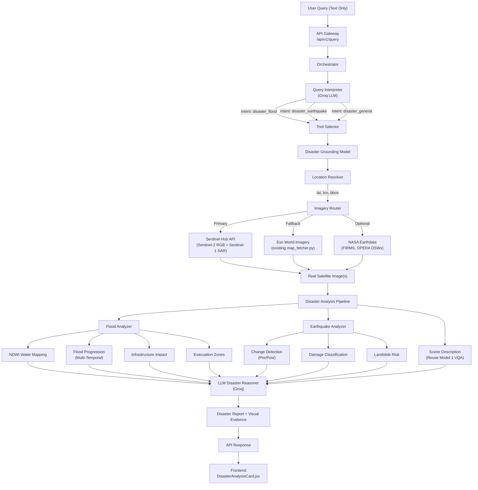
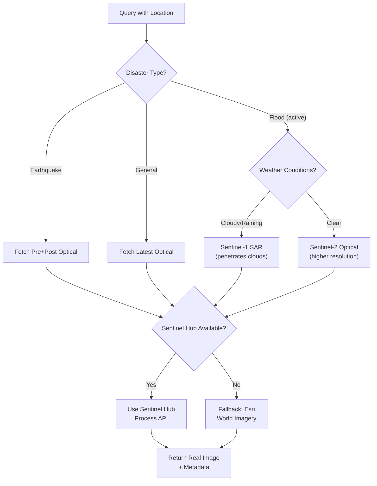

# Model 2 — System Architecture & Data Flow

## High-Level Architecture



---

## Data Flow — Flood Query Example

```
Input:  "Show flood progression in Wayanad, Kerala"

Step 1: Query Interpreter
  ├── intent: "disaster_flood"
  ├── location: "Wayanad, Kerala"
  ├── disaster_type: "flood"
  └── temporal: "progression" → needs multi-temporal

Step 2: Location Resolution
  ├── Geocode: "Wayanad, Kerala" → (11.6854, 76.1320)
  ├── BBox: [76.0, 11.5, 76.3, 11.9]
  └── Area: 5000m × 5000m (wider for disaster)

Step 3: Imagery Fetching
  ├── Sentinel-2 T-14d: RGB image (pre-flood)
  ├── Sentinel-2 T-7d:  RGB image (early flood)
  ├── Sentinel-2 T+0:   RGB image (current)
  ├── Sentinel-2 NDWI:  Water index for each date
  └── Sentinel-1 SAR:   Cloud-penetrating flood map

Step 4: Flood Analysis
  ├── NDWI thresholding → water mask at each timestep
  ├── Difference: T+0 minus T-14d → flood expansion map
  ├── Progression rate: ΔA/Δt = km²/day
  ├── Building detection within flood mask → affected count
  └── Safe zone identification → evacuation areas

Step 5: LLM Synthesis
  ├── Situation assessment
  ├── Escalation recommendation
  ├── Evacuation priorities
  ├── 24-48h progression prediction
  └── Resource deployment suggestions

Step 6: Response Assembly
  ├── Disaster report (text)
  ├── Flood extent overlay (visual evidence)
  ├── Temporal progression animation/carousel
  ├── Bounding boxes (affected infrastructure)
  ├── Evacuation zone map
  └── Full audit trail
```

---

## Integration Points with Existing System

```
EXISTING SYSTEM                          MODEL 2 ADDITIONS
─────────────────                        ──────────────────

┌─────────────────────┐
│   query_interpreter │
│   ├── building_det  │
│   ├── water_det     │                  ┌──────────────────────┐
│   ├── vegetation    │     + ADD ──────►│ disaster_flood       │
│   ├── change_det    │                  │ disaster_earthquake  │
│   └── general_vqa   │                  │ disaster_general     │
└─────────────────────┘                  └──────────────────────┘

┌─────────────────────┐
│   tool_selector     │
│   ├── vqa_model     │
│   ├── grounding     │
│   ├── roboflow_bd   │                  ┌──────────────────────────┐
│   ├── spectral_idx  │     + ADD ──────►│ disaster_grounding_model │
│   ├── change_det    │                  └──────────────────────────┘
│   └── sar_fusion    │
└─────────────────────┘

┌─────────────────────┐
│   execution_engine  │
│   ├── VQAModel      │
│   ├── GroundingModel│
│   ├── Roboflow      │                  ┌──────────────────────────┐
│   ├── SpectralIndex │     + ADD ──────►│ DisasterGroundingModel   │
│   ├── ChangeDet     │                  │ (wraps FloodAnalyzer,    │
│   └── SARFusion     │                  │  EarthquakeAnalyzer,     │
└─────────────────────┘                  │  DisasterLLMReasoner)    │
                                         └──────────────────────────┘

┌─────────────────────┐
│   geospatial/       │
│   ├── map_fetcher   │                  ┌──────────────────────────┐
│   ├── metadata_par  │     + ADD ──────►│ sentinel_fetcher.py      │
│   ├── coord_system  │                  │ imagery_router.py        │
│   └── tile_proc     │                  └──────────────────────────┘
└─────────────────────┘
```

---

## Satellite Imagery Fetch Decision Tree



---

## Module Dependency Graph

```
disaster_grounding_model.py
    ├── geospatial/sentinel_fetcher.py
    │     └── sentinelhub (pip package)
    ├── geospatial/imagery_router.py
    │     ├── sentinel_fetcher.py
    │     └── map_fetcher.py (existing)
    ├── models/disaster_analysis/flood_analyzer.py
    │     ├── models/spectral_index_model.py (existing, NDWI)
    │     └── models/roboflow_building_detector.py (existing)
    ├── models/disaster_analysis/earthquake_analyzer.py
    │     └── models/change_detection_model.py (existing)
    ├── models/disaster_analysis/disaster_llm_reasoner.py
    │     └── models/llm/groq_engine.py (existing)
    └── models/vqa_model.py (existing, for scene description)
```
